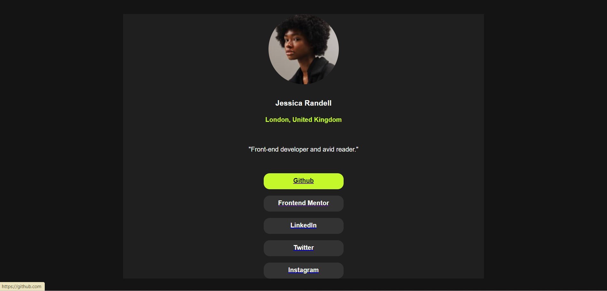

# Frontend Mentor - Social links profile solution

This is a solution to the [Social links profile challenge on Frontend Mentor](https://www.frontendmentor.io/challenges/social-links-profile-UG32l9m6dQ). Frontend Mentor challenges help you improve your coding skills by building realistic projects. 

## Table of contents

- [Overview](#overview)
  - [The challenge](#the-challenge)
  - [Screenshot](#screenshot)
- [My process](#my-process)
  - [Built with](#built-with)
  - [What I learned](#what-i-learned)
  - [Continued development](#continued-development)
- [Author](#author)
- [Acknowledgments](#acknowledgments)

## Overview

### The challenge

Users should be able to:

- See hover and focus states for all interactive elements on the page

### Screenshot

## My process

### Built with

- Semantic HTML5 markup
- CSS custom properties

### What I learned

I learned how to use div tags to seperate sections on the window and many other html tags that I have used in this project.

I am proud that I could complete this project successfully with a basic knowledge of html and css.

### Continued development

I am planning to do my future project in more concise way and neatly more than this.

## Author

- Frontend Mentor - [@udanilokuhetti](https://www.frontendmentor.io/profile/@udanilokuhetti)

## Acknowledgments

You can complete this project if you have the basic knowledge of html and css. Good Luck!

